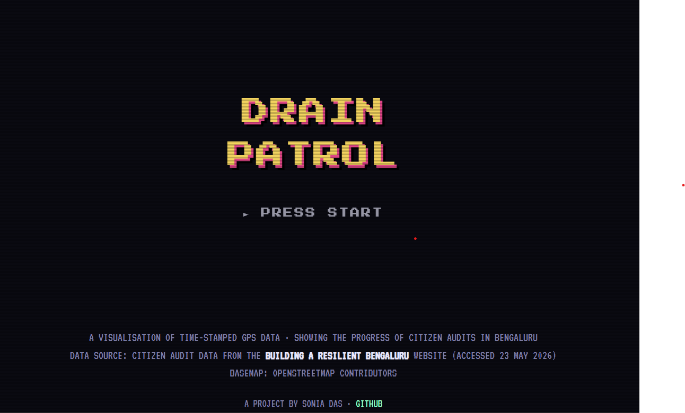
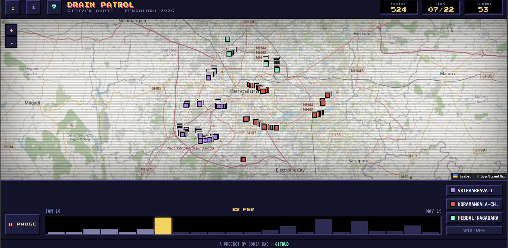

---
tags:
  - Geospatial Science
  - Stormwater Drains
  - Open Source Tools
---

# Can we make geospatial science easier to discover?

That's the question I've been thinking about lately.

I built this interactive visualisation of stormwater drain observations from Bengaluru.

🔗 [soniadas123.github.io/blr-swd-game](https://soniadas123.github.io/blr-swd-game/)

By design, it doesn't explain everything. Instead, it's meant to evoke questions.

- What are these dots?
- Where did they come from?
- How were they collected?
- Why is there a timestamp?
- Why are these observations clustered in certain places?
- Why does a city need this data?

Every dot on the map represents a real observation collected in the field. Behind that simple point are GPS, field surveys, open-source tools like ODK, timestamps, spatial databases, and people working to understand a city.

The visualisation is only the starting point. The real goal is curiosity.

Because I believe that's where spatial thinking begins. Not with software or code, with questions.

If this visualisation made you ask even one question, then it has already done its job.
